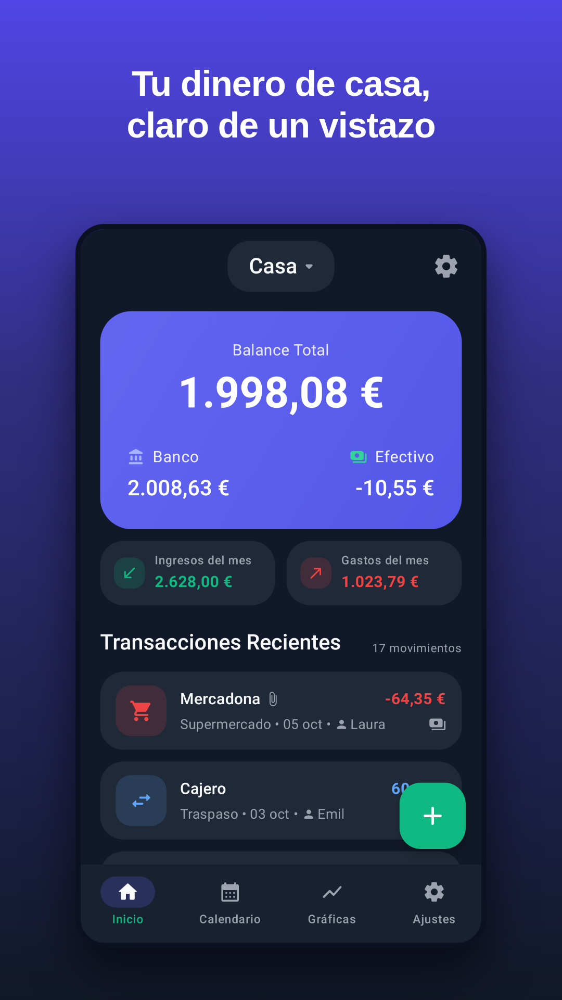
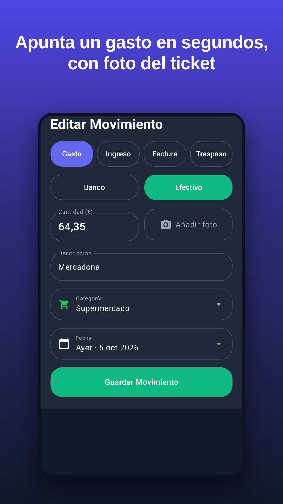
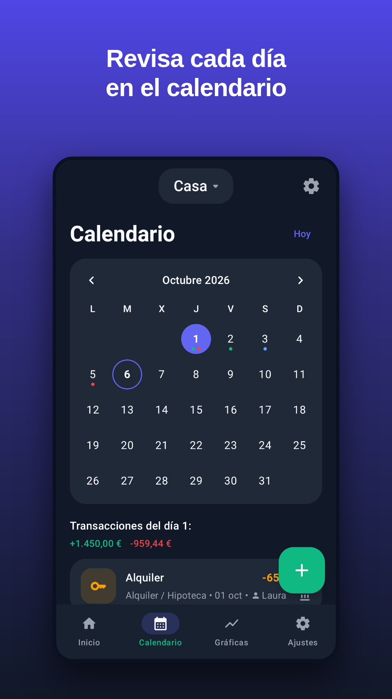
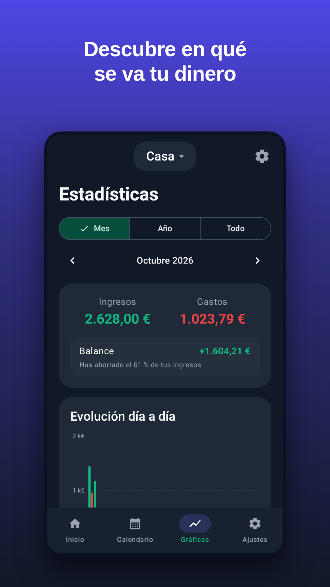
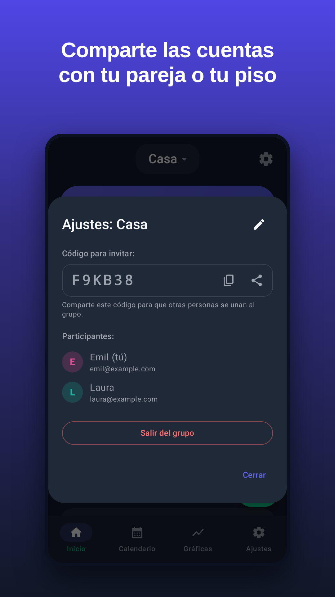

# MiGasto

**Las cuentas de casa, claras y compartidas.** App Android nativa para apuntar gastos, ingresos y facturas, separar **banco** y **efectivo**, revisarlo todo en un calendario, descubrir en qué se va el dinero con gráficas y compartir las cuentas con tu pareja o tus compañeros de piso.

<p align="center">
  
  
  
  
  
</p>

## Funciones

- **Inicio**: balance total con desglose banco / efectivo, ingresos y gastos del mes y lista de movimientos (con quién lo añadió).
- **Añadir movimiento**: gasto, ingreso, factura o **traspaso** entre banco y efectivo (p. ej. sacar del cajero), importe, descripción, categoría con icono, fecha y **foto del ticket** (cámara o galería). Se pueden editar y eliminar.
- **Calendario**: mes a mes, con puntos verdes/rojos en los días con ingresos/gastos y el detalle de cada día.
- **Gráficas**: por mes, año o todo; barras de evolución diaria/mensual, gastos por categoría (anillo), por cuenta y por miembro del grupo, y tasa de ahorro.
- **Grupos**: varios grupos (Casa, Viaje, Pareja…). En modo nube se comparten con un **código de invitación** de 6 letras; quien crea el grupo puede **quitar miembros** (con o sin sus movimientos) y **cerrarlo a nuevos miembros**.
- **Ajustes**: perfil, tema **Sistema / Claro / Oscuro**, **exportar a CSV** (Excel / Google Sheets), **«Invítame a un café» por Bizum** (se puede ocultar en la versión de Play con `-Pmigasto.bizum=false`), política de privacidad, cerrar sesión y **eliminar la cuenta** (obligatorio en Google Play).
- Español e inglés, modo oscuro y claro, iconos temáticos de Android 13+, pantallas grandes y copia de seguridad de Android en modo local.

### Mejoras respecto al diseño original
- Los textos largos ya no se parten letra a letra («Desco/nocid/o», «Oscur/o»): se recortan con «…» y los selectores usan botones segmentados.
- El autor de cada movimiento se guarda con su nombre (adiós a «Desconocido») y los participantes del grupo se muestran con nombre y email.
- Navegación de meses en el calendario y en las gráficas, escala y detalle al tocar las barras.
- Importes en céntimos (sin errores de redondeo) y formato español: `1.998,08 €`.

## Dos modos de funcionamiento

| | Modo local (por defecto) | Modo nube (Firebase) |
|---|---|---|
| Cuenta | No hace falta: solo tu nombre | Email y contraseña o **Continuar con Google** |
| Dónde se guardan los datos | Solo en el móvil | Cloud Firestore (sincronizado) |
| Compartir grupos | No | Sí, con código de invitación |
| Coste | Gratis | Gratis (plan Spark de Firebase) |

La app detecta sola el modo: si se compila con `app/google-services.json` funciona en la nube; si no, en local. El APK que se entrega sin configurar Firebase funciona **en modo local** desde el primer momento.

👉 Para activar la nube y los grupos compartidos: **[docs/CONFIGURAR_FIREBASE.md](docs/CONFIGURAR_FIREBASE.md)** (unos 10 minutos).

## Publicar en Google Play

Guía completa paso a paso, con los textos de la ficha y las respuestas de los formularios: **[docs/PUBLICAR_EN_GOOGLE_PLAY.md](docs/PUBLICAR_EN_GOOGLE_PLAY.md)**.

Material listo en [`docs/play-store/`](docs/play-store): icono 512×512, gráfico destacado 1024×500 y 6 capturas 1080×1920. La política de privacidad y la página de eliminación de cuenta están en [`docs/`](docs) para publicarlas gratis con GitHub Pages.

## Compilar

Requisitos: JDK 17+ (recomendado 21) y Android SDK (Android Studio lo instala solo).

```bash
./gradlew :app:assembleDebug            # APK de pruebas
./gradlew :app:testDebugUnitTest        # tests + capturas en app/build/screenshots
./gradlew :app:assembleRelease          # APK firmado (necesita keystore.properties)
./gradlew :app:bundleRelease            # AAB para Google Play
```

### Firma de la versión release
Crea `keystore.properties` en la raíz (está en `.gitignore`, **nunca lo subas**):

```properties
storeFile=release-output/migasto-upload.jks
storePassword=...
keyAlias=migasto
keyPassword=...
```

En GitHub Actions se usan los secretos `MIGASTO_KEYSTORE_BASE64`, `MIGASTO_KEYSTORE_PASSWORD`, `MIGASTO_KEY_ALIAS` y `MIGASTO_KEY_PASSWORD` (y `GOOGLE_SERVICES_JSON` para el modo nube). Cada push genera el APK y el AAB como artefactos descargables.

## Tecnología

- Kotlin 2.4, Jetpack Compose + Material 3, arquitectura MVVM con `StateFlow`.
- Room (modo local), Firebase Authentication (email o Google con Credential Manager) + Cloud Firestore con caché sin conexión (modo nube). Las fotos se comprimen (< 700 KB) y se guardan en Firestore para no necesitar el plan de pago.
- DataStore, Coil, SplashScreen, `FileProvider` para cámara y CSV, selector de fotos del sistema (sin permisos de almacenamiento ni de cámara).
- minSdk 26 (Android 8), targetSdk 36 (Android 16), compileSdk 37, AGP 9.4, R8.

### Estructura

```
app/src/main/java/com/chiiraac/migasto/
├── data/          modelos, repositorios (local: Room · remote: Firebase), preferencias
├── domain/        cálculos puros: saldo, estadísticas, fechas, importes, CSV
├── ui/            pantallas Compose: auth, home, calendar, stats, settings, groups, movement
└── util/          compresión de fotos
firestore.rules    reglas de seguridad (solo los miembros acceden a su grupo)
firebase-tests/    pruebas de las reglas con el emulador de Firebase
tools/             generador de gráficos para Google Play
```

### Tests
- `./gradlew :app:testDebugUnitTest`: lógica (saldos, estadísticas, importes, fechas, CSV), repositorio local con Room y **capturas de todas las pantallas** con Robolectric + Roborazzi.
- `cd firebase-tests && npm ci && npm test`: reglas de seguridad de Firestore en el emulador.
- `cd firebase-tests && npm run test:android`: flujo completo del modo nube (registro, grupos, invitaciones, fotos, borrado de cuenta) contra los emuladores de Firebase.
